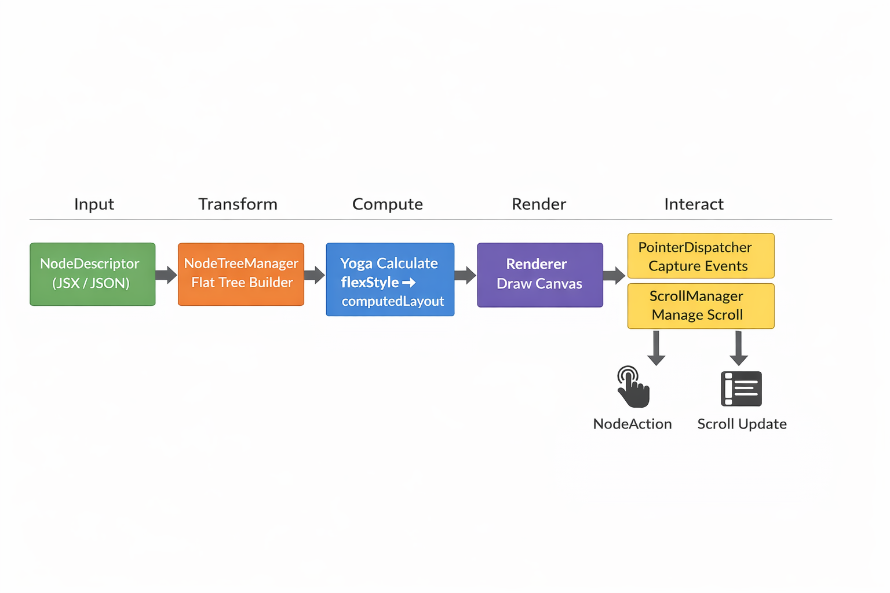

# Yoga Canvas

Yoga Canvas is a high-performance, lightweight **Canvas rendering engine** that bridges the layout capabilities of **Yoga (Flexbox)** with the drawing power of **Canvas 2D**. It provides a React-like declarative UI rendering solution for H5 and WeChat Mini Programs.

<p align="center">
  
</p>

---

## 🚀 Key Features

- **Flexbox Layout**: Powered by Facebook's Yoga engine, supporting `flex-direction`, `justify-content`, `gap`, absolute positioning, and more.
- **Declarative UI**: Familiar React component pattern (`View`, `Text`, `Image`, `ScrollView`) with extremely low learning curve.
- **High Performance**: 60FPS smooth experience even with thousands of nodes, thanks to optimized Canvas rendering.
- **Visual Richness**: Support for gradients, shadows, rounded corners, text truncation, and Tailwind CSS class parsing.
- **Cross-Platform**: Unified rendering across H5 and WeChat Mini Programs via a robust Adapter layer.
- **Interactive**: Full event system with capture/bubble phases and high-precision hit testing.

---

## 🔗 Quick Links

- **[Live Demo & Editor](https://lierwa.github.io/yoga-canvas/workspace)**: Visual layout tool with real-time property tweaking.
- **[Documentation](https://lierwa.github.io/yoga-canvas/)**: Comprehensive guides, API references, and best practices.

---

## 📦 Installation

```bash
pnpm add @yoga-canvas/core @yoga-canvas/react
```

---

## 💻 Quick Start (React)

```tsx
import { YogaCanvas, View, Text } from '@yoga-canvas/react';

export function MyCanvas() {
  return (
    <YogaCanvas width={375} height={240}>
      <View style={{ width: 375, height: 240, padding: 16, backgroundColor: '#050816' }}>
        <Text
          content="Hello Yoga Canvas"
          style={{ fontSize: 18, color: '#ffffff', lineHeight: 1.4 }}
        />
      </View>
    </YogaCanvas>
  );
}
```

---

## 🛠 Usage Modes

1. **React (JSX)**: The most recommended way for React/Next.js/Taro applications.
2. **Pure JS (API)**: Use directly in logic-heavy environments or non-React projects.
3. **JSON Schema**: Load layouts from dynamic JSON data for Server-Driven UI.

---

## 📄 License

MIT © [lierwa](https://github.com/lierwa)
